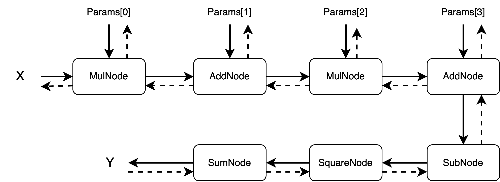

# TinyTorch

tinytorch：一个简化版本的pytorch，支持cuda设备，便于理解pytorch的内在机理

## 通过本项目，你可以

- 了解基础算子前向反向计算过程
- 了解构建计算图、自动求导相关流程
- 了解如何进行单元测试
- 了解如何开发cuda算子
- 了解算子的注册与dispatch到不同设备上的流程
- 了解内存管理的基本操作
- 了解如何使用`pybind11`和导出c++源码到python
- 了解如何使用`cmake`、`pip`和包管理机制等

## 构建TinyTorch

- clone仓库:

`git clone git@github.com:yewentao256/TinyTorch.git`

- Build Tinytorch

```bash
pip install .
pip install . -v        # -v可以看到安装过程中更多信息
DEBUG=1 pip install .   # DEBUG环境变量编译debug版本TinyTorch
CUDA=1 pip install .    # 编译CUDA版本Tinytorch

DEBUG=1 CUDA=1 pip install . -v
```

## 示例程序的计算图表示



## 单元测试

本项目有两种单元测试:

- C++ 单元测试: 定义在 `unit_test.hpp`中, 测试项目内部使用的API
- Python 单元测试: 定义在 `test.py`, 包括集成测试和其他单元测试.

## 参考

- [TinyTorch](https://github.com/darglein/TinyTorch)
- [Pybind11](https://pybind11.readthedocs.io/en/stable/index.html)
- [Cmake_cpp_pybind11_tutorial](https://github.com/smrfeld/cmake_cpp_pybind11_tutorial)
- [Pytorch](https://github.com/pytorch/pytorch)
- [Cuda_samples](https://github.com/NVIDIA/cuda-samples)
- [Simple-tensor](https://github.com/XuHQ1997/simple-tensor)
